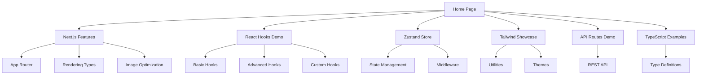

# Documento de Requisitos do Produto - React Hooks Next.js Demo

## 1. Product Overview
Uma aplicação de demonstração didática que integra Next.js 15.5.2, TypeScript, App Router, Zustand e Tailwind CSS para servir como referência completa de estudos.
O projeto demonstra na prática todos os recursos principais dessas tecnologias através de exemplos funcionais e interativos.
Objetivo: criar uma referência técnica abrangente para desenvolvedores que desejam aprender a integração dessas tecnologias modernas.

## 2. Core Features

### 2.1 User Roles
Não há distinção de papéis de usuário - a aplicação é focada em demonstração técnica e educacional.

### 2.2 Feature Module
Nossa aplicação de demonstração consiste nas seguintes páginas principais:
1. **Home page**: hero section, navegação principal, overview das tecnologias demonstradas.
2. **Next.js Features**: demonstração de App Router, renderização estática/dinâmica, metadados, otimizações de imagem.
3. **React Hooks Demo**: exemplos práticos de todos os React Hooks disponíveis na última versão.
4. **Zustand Store**: gerenciamento de estado global, persistência, middlewares.
5. **Tailwind Showcase**: utilitários CSS, temas personalizados, responsividade.
6. **API Routes Demo**: exemplos de API Routes do Next.js com diferentes tipos de resposta.
7. **TypeScript Examples**: demonstração de tipagem avançada e melhores práticas.

### 2.3 Page Details

| Page Name | Module Name | Feature description |
|-----------|-------------|---------------------|
| Home page | Hero section | Apresenta overview das tecnologias com navegação interativa e animações |
| Home page | Technology cards | Cards responsivos mostrando cada tecnologia com links para demonstrações |
| Home page | Quick stats | Estatísticas em tempo real usando Zustand para demonstrar reatividade |
| Next.js Features | App Router demo | Navegação entre rotas, layouts aninhados, loading states |
| Next.js Features | Static/Dynamic rendering | Comparação visual entre SSG, SSR e CSR com métricas de performance |
| Next.js Features | Metadata generation | Demonstração de SEO dinâmico e Open Graph tags |
| Next.js Features | Image optimization | Galeria de imagens com lazy loading e diferentes formatos |
| React Hooks Demo | Basic hooks | useState, useEffect, useContext com exemplos interativos |
| React Hooks Demo | Advanced hooks | useReducer, useMemo, useCallback, useRef com casos práticos |
| React Hooks Demo | Custom hooks | Hooks personalizados para fetch, localStorage, theme switching |
| Zustand Store | State management | Counter, todo list, user preferences com persistência |
| Zustand Store | Middleware demo | Logging, persistence, devtools integration |
| Zustand Store | Store composition | Múltiplas stores e composição de estado |
| Tailwind Showcase | Utility classes | Grid, flexbox, spacing, colors com exemplos visuais |
| Tailwind Showcase | Custom themes | Dark/light mode, custom color palettes, typography |
| Tailwind Showcase | Responsive design | Breakpoints, mobile-first design, adaptive layouts |
| API Routes Demo | REST endpoints | GET, POST, PUT, DELETE com diferentes tipos de dados |
| API Routes Demo | Error handling | Tratamento de erros, validação, status codes |
| TypeScript Examples | Type definitions | Interfaces, types, generics com exemplos práticos |
| TypeScript Examples | Advanced patterns | Utility types, conditional types, mapped types |

## 3. Core Process
O usuário navega pela aplicação explorando diferentes seções de demonstração. Cada página contém exemplos interativos que podem ser testados em tempo real.

Fluxo principal do usuário:
1. Acessa a homepage e visualiza overview das tecnologias
2. Navega para seções específicas através do menu principal
3. Interage com exemplos práticos em cada seção
4. Visualiza código-fonte e explicações técnicas
5. Testa funcionalidades como mudança de tema, persistência de estado

## 4. User Interface Design
### 4.1 Design Style
- **Cores primárias**: Azul (#3B82F6), Verde (#10B981), Roxo (#8B5CF6)
- **Cores secundárias**: Cinza (#6B7280), Branco (#FFFFFF), Preto (#111827)
- **Estilo de botões**: Rounded corners (8px), gradientes suaves, hover effects
- **Fonte**: Inter (16px base), código com JetBrains Mono
- **Layout**: Card-based design, navegação top horizontal, sidebar para código
- **Ícones**: Heroicons, emojis para seções (⚛️ React, 🎨 Tailwind, 🐻 Zustand)

### 4.2 Page Design Overview

| Page Name | Module Name | UI Elements |
|-----------|-------------|-------------|
| Home page | Hero section | Gradient background (#3B82F6 to #8B5CF6), large typography (48px), animated icons |
| Home page | Technology cards | Grid layout (3 columns desktop, 1 mobile), hover animations, shadow effects |
| React Hooks Demo | Code examples | Split layout (50% demo, 50% code), syntax highlighting, live editing |
| Zustand Store | State visualizer | Real-time state tree, JSON viewer, action history |
| Tailwind Showcase | Utility demo | Interactive playground, color swatches, responsive preview |
| API Routes Demo | Request/Response | HTTP method badges, JSON formatting, status indicators |

### 4.3 Responsiveness
Design mobile-first com breakpoints Tailwind (sm: 640px, md: 768px, lg: 1024px, xl: 1280px). Otimizado para touch interaction com botões de pelo menos 44px de altura e espaçamento adequado entre elementos interativos.