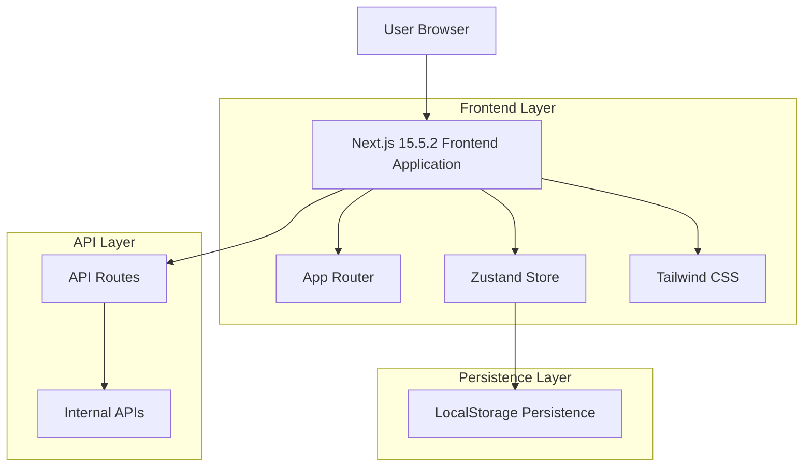
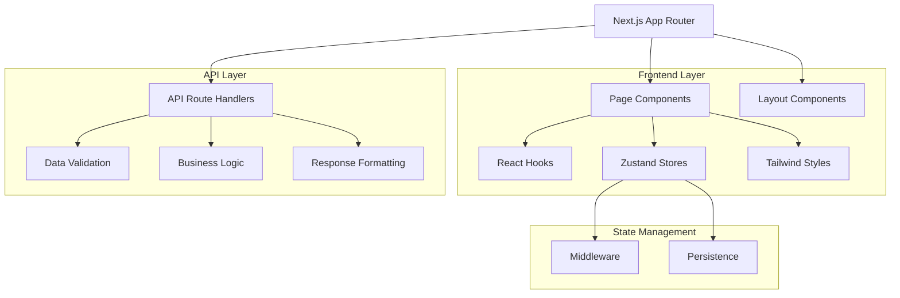
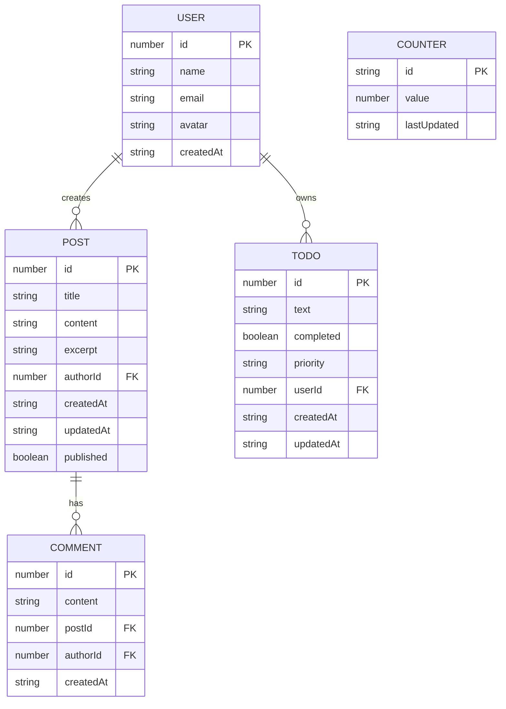

# Documento de Arquitetura Técnica - React Hooks Next.js Demo

## 1. Architecture design



## 2. Technology Description

* Frontend: Next.js\@15.5.2 + React\@18 + TypeScript\@5 + Tailwind CSS\@3 + Zustand\@4

* Build Tool: Turbopack (Next.js 15 default)

* Testing: Jest + React Testing Library

* Linting: ESLint + Prettier

* Package Manager: pnpm

## 3. Route definitions

| Route                | Purpose                                                                      |
| -------------------- | ---------------------------------------------------------------------------- |
| /                    | Home page com overview das tecnologias e navegação principal                 |
| /nextjs              | Demonstração de recursos do Next.js 15.5.2 (App Router, rendering, metadata) |
| /nextjs/app-router   | Exemplos específicos de App Router e layouts                                 |
| /nextjs/rendering    | Comparação entre SSG, SSR e CSR                                              |
| /nextjs/images       | Galeria demonstrando otimizações de imagem                                   |
| /hooks               | Página principal de demonstração dos React Hooks                             |
| /hooks/basic         | useState, useEffect, useContext com exemplos interativos                     |
| /hooks/advanced      | useReducer, useMemo, useCallback, useRef                                     |
| /hooks/custom        | Hooks personalizados (useLocalStorage, useFetch, useTheme)                   |
| /zustand             | Demonstração do gerenciamento de estado com Zustand                          |
| /zustand/basic       | Counter e todo list básicos                                                  |
| /zustand/middleware  | Logging, persistence, devtools                                               |
| /zustand/composition | Múltiplas stores e composição                                                |
| /tailwind            | Showcase dos recursos do Tailwind CSS                                        |
| /tailwind/utilities  | Grid, flexbox, spacing, colors                                               |
| /tailwind/themes     | Dark/light mode, custom themes                                               |
| /tailwind/responsive | Breakpoints e design responsivo                                              |
| /typescript          | Exemplos de TypeScript avançado                                              |
| /typescript/types    | Interfaces, types, generics                                                  |
| /typescript/patterns | Utility types, conditional types                                             |

## 4. API definitions

### 4.1 Core API

Dados de demonstração

```
GET /api/demo-data
```

Response:

| Param Name | Param Type | Description                  |
| ---------- | ---------- | ---------------------------- |
| users      | User\[]    | Lista de usuários de exemplo |
| posts      | Post\[]    | Posts de blog de exemplo     |
| stats      | Stats      | Estatísticas da aplicação    |

Example:

```json
{
  "users": [
    {
      "id": 1,
      "name": "João Silva",
      "email": "joao@example.com",
      "avatar": "/avatars/joao.jpg"
    }
  ],
  "posts": [
    {
      "id": 1,
      "title": "Introdução ao Next.js 15",
      "content": "Conteúdo do post...",
      "authorId": 1,
      "createdAt": "2024-01-15T10:00:00Z"
    }
  ],
  "stats": {
    "totalUsers": 150,
    "totalPosts": 45,
    "activeUsers": 23
  }
}
```

Contador global

```
POST /api/counter
```

Request:

| Param Name | Param Type | isRequired | Description                                   |
| ---------- | ---------- | ---------- | --------------------------------------------- |
| action     | string     | true       | 'increment' ou 'decrement'                    |
| value      | number     | false      | Valor a ser adicionado/subtraído (default: 1) |

Response:

| Param Name | Param Type | Description             |
| ---------- | ---------- | ----------------------- |
| count      | number     | Valor atual do contador |
| timestamp  | string     | Timestamp da operação   |

Todo items

```
GET /api/todos
POST /api/todos
PUT /api/todos/[id]
DELETE /api/todos/[id]
```

Validação de formulário

```
POST /api/validate
```

Request:

| Param Name | Param Type | isRequired | Description          |
| ---------- | ---------- | ---------- | -------------------- |
| email      | string     | true       | Email para validação |
| password   | string     | true       | Senha para validação |

Response:

| Param Name | Param Type | Description                 |
| ---------- | ---------- | --------------------------- |
| valid      | boolean    | Se os dados são válidos     |
| errors     | string\[]  | Lista de erros de validação |

## 5. Server architecture diagram



## 6. Data model

### 6.1 Data model definition



### 6.2 Data Definition Language

```typescript
// Types para demonstração (não há banco de dados real)

interface User {
  id: number;
  name: string;
  email: string;
  avatar: string;
  createdAt: string;
}

interface Post {
  id: number;
  title: string;
  content: string;
  excerpt: string;
  authorId: number;
  createdAt: string;
  updatedAt: string;
  published: boolean;
}

interface Todo {
  id: number;
  text: string;
  completed: boolean;
  priority: 'low' | 'medium' | 'high';
  userId: number;
  createdAt: string;
  updatedAt: string;
}

interface Comment {
  id: number;
  content: string;
  postId: number;
  authorId: number;
  createdAt: string;
}

interface Counter {
  id: string;
  value: number;
  lastUpdated: string;
}

interface AppStats {
  totalUsers: number;
  totalPosts: number;
  activeUsers: number;
  totalTodos: number;
  completedTodos: number;
}

// Zustand Store Types
interface CounterStore {
  count: number;
  increment: () => void;
  decrement: () => void;
  reset: () => void;
}

interface TodoStore {
  todos: Todo[];
  addTodo: (text: string, priority: Todo['priority']) => void;
  toggleTodo: (id: number) => void;
  deleteTodo: (id: number) => void;
  updateTodo: (id: number, updates: Partial<Todo>) => void;
}

interface ThemeStore {
  theme: 'light' | 'dark';
  toggleTheme: () => void;
  setTheme: (theme: 'light' | 'dark') => void;
}

interface UserStore {
  user: User | null;
  setUser: (user: User) => void;
  clearUser: () => void;
  updateUser: (updates: Partial<User>) => void;
}
```

### 6.3 Dados iniciais para demonstração

```typescript
// Dados mockados para demonstração
const initialUsers: User[] = [
  {
    id: 1,
    name: "João Silva",
    email: "joao@example.com",
    avatar: "/avatars/joao.jpg",
    createdAt: "2024-01-15T10:00:00Z"
  },
  {
    id: 2,
    name: "Maria Santos",
    email: "maria@example.com",
    avatar: "/avatars/maria.jpg",
    createdAt: "2024-01-16T14:30:00Z"
  }
];

const initialPosts: Post[] = [
  {
    id: 1,
    title: "Introdução ao Next.js 15",
    content: "Next.js 15 trouxe muitas novidades...",
    excerpt: "Descubra as principais novidades do Next.js 15",
    authorId: 1,
    createdAt: "2024-01-15T10:00:00Z",
    updatedAt: "2024-01-15T10:00:00Z",
    published: true
  }
];

const initialTodos: Todo[] = [
  {
    id: 1,
    text: "Estudar React Hooks",
    completed: false,
    priority: "high",
    userId: 1,
    createdAt: "2024-01-15T10:00:00Z",
    updatedAt: "2024-01-15T10:00:00Z"
  
```

