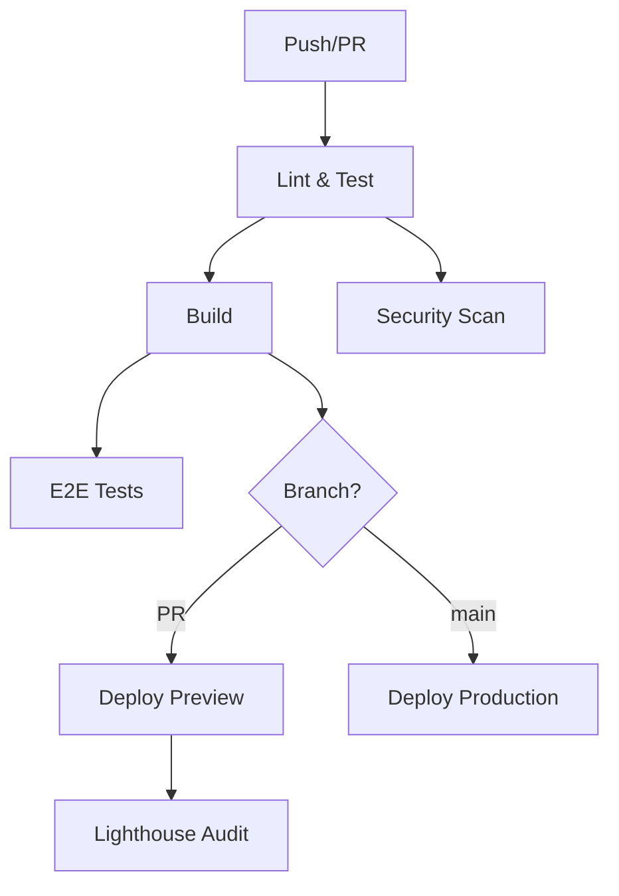

# NextCook

**Cookbook abrangente para desenvolvedores Next.js**

NextCook é um guia prático e organizado com as principais bibliotecas e funcionalidades essenciais para desenvolvedores Next.js em seu dia a dia profissional. O material é estruturado por tópicos e níveis de complexidade, oferecendo exemplos de código aplicáveis imediatamente.

## Características

- 🍳 **Prático** - Exemplos de código prontos para uso
- 📚 **Organizado** - Estruturado por tópicos e níveis de complexidade
- 🔍 **Fácil consulta** - Sistema de busca e navegação intuitiva
- 🌟 **Abrangente** - Desde configurações iniciais até técnicas avançadas
- ⚡ **Atualizado** - Melhores práticas e versões recentes

## Conteúdo

- Configuração de projetos
- Roteamento e navegação
- Gerenciamento de estado (Zustand, Jotai, TanStack Query)
- Integração com APIs e backend
- Otimizações de performance
- Padrões de arquitetura
- Soluções para problemas comuns
- Biblioteca de snippets
- Troubleshooting

## Getting Started

First, run the development server:

```bash
npm run dev
# or
yarn dev
# or
pnpm dev
# or
bun dev
```

Open [http://localhost:3000](http://localhost:3000) with your browser to see the result.

You can start editing the page by modifying `app/page.tsx`. The page auto-updates as you edit the file.

This project uses [`next/font`](https://nextjs.org/docs/app/building-your-application/optimizing/fonts) to automatically optimize and load [Geist](https://vercel.com/font), a new font family for Vercel.

## Learn More

To learn more about Next.js, take a look at the following resources:

- [Next.js Documentation](https://nextjs.org/docs) - learn about Next.js features and API.
- [Learn Next.js](https://nextjs.org/learn) - an interactive Next.js tutorial.

You can check out [the Next.js GitHub repository](https://github.com/vercel/next.js) - your feedback and contributions are welcome!

## Scripts Disponíveis

```bash
# Desenvolvimento
pnpm dev              # Inicia servidor de desenvolvimento
pnpm build            # Build de produção
pnpm start            # Inicia servidor de produção
pnpm preview          # Build + start (preview local)

# Qualidade de código
pnpm lint             # ESLint
pnpm type-check       # Verificação TypeScript
pnpm test             # Testes unitários
pnpm test:e2e         # Testes E2E com Playwright
pnpm check            # Lint + testes
pnpm ci               # Pipeline completo (lint + type-check + test + build)

# Utilitários
pnpm clean            # Limpa arquivos de build
pnpm build:analyze    # Build com análise de bundle
```

## CI/CD e Deploy

### Configuração Automática

O projeto está configurado com GitHub Actions para CI/CD automático:

- **Pull Requests**: Deploy de preview automático
- **Branch main**: Deploy de produção automático
- **Testes**: Execução automática de lint, testes unitários e E2E
- **Segurança**: Scan de vulnerabilidades com Trivy
- **Performance**: Auditoria Lighthouse automática

### Variáveis de Ambiente Necessárias

Configure as seguintes secrets no GitHub:

```bash
# Vercel (obrigatório)
VERCEL_TOKEN=your_vercel_token
VERCEL_ORG_ID=your_org_id
VERCEL_PROJECT_ID=your_project_id

# Opcionais
CODECOV_TOKEN=your_codecov_token
LHCI_GITHUB_APP_TOKEN=your_lighthouse_token
```

### Como Obter as Credenciais Vercel

1. **VERCEL_TOKEN**:
   ```bash
   npx vercel login
   npx vercel --token
   ```

2. **VERCEL_ORG_ID e VERCEL_PROJECT_ID**:
   ```bash
   npx vercel link
   # Os IDs estarão em .vercel/project.json
   ```

### Deploy Manual

```bash
# Instalar Vercel CLI
npm i -g vercel

# Login
vercel login

# Deploy de preview
vercel

# Deploy de produção
vercel --prod
```

### Configuração do Projeto Vercel

O arquivo `vercel.json` inclui:

- ✅ Headers de segurança
- ✅ Cache otimizado para assets
- ✅ Redirects e rewrites
- ✅ Configurações de build
- ✅ Cron jobs

### Monitoramento

- **Performance**: Lighthouse CI em cada PR
- **Segurança**: Trivy security scan
- **Cobertura**: Codecov integration
- **E2E**: Playwright tests automáticos

## Estrutura do Workflow



## Deploy on Vercel

O deploy é automatizado via GitHub Actions, mas você também pode usar:

[](https://vercel.com/new/clone?repository-url=https://github.com/your-username/nextcook)

Para deploy manual, consulte a [documentação do Next.js](https://nextjs.org/docs/app/building-your-application/deploying).
